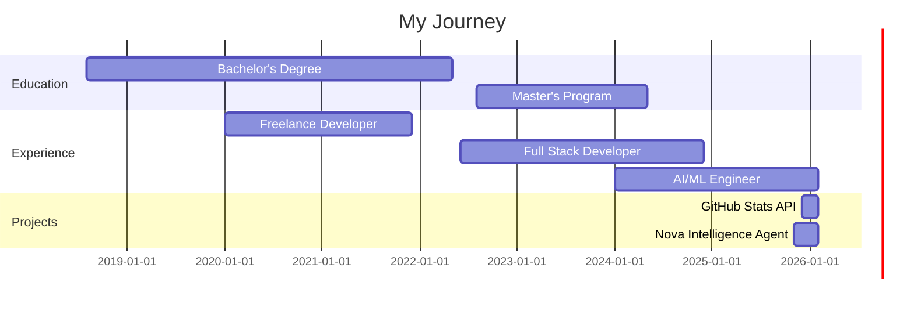

<div align="center">

# 👋 Hi, I'm Mukul Prasad


[](https://github.com/MUKUL-PRASAD-SIGH)
[](https://github.com/MUKUL-PRASAD-SIGH?tab=followers)
[](https://github.com/MUKUL-PRASAD-SIGH?tab=repositories)

</div>

---

## 🌟 About Me

```python
class MukulPrasad:
    def __init__(self):
        self.username = "MUKUL-PRASAD-SIGH"
        self.name = "Mukul Prasad"
        self.role = "Full Stack Developer & AI Enthusiast"
        self.location = "India 🇮🇳"
        self.languages = ["Python", "JavaScript", "TypeScript", "Java", "C++"]
        self.interests = ["AI/ML", "Web Development", "Cloud Computing", "DevOps"]
        
    def say_hi(self):
        print("Thanks for dropping by! Let's build something amazing together!")

me = MukulPrasad()
me.say_hi()
```

<div align="center">

### 🚀 Quick Facts

🔭 Currently working on **AI-powered GitHub Analytics & Multi-Agent Systems**  
🌱 Learning **Advanced FastAPI, AWS, Kubernetes, and LLM Integration**  
💬 Ask me about **Python, FastAPI, React, AI/ML, Cloud Architecture**  
📫 Reach me: **your-email@example.com**  
⚡ Fun fact: **I built my own GitHub stats API from scratch!**

</div>

---

## 📊 GitHub Statistics

<div align="center">

### 📈 Overall Performance


### 🔥 Contribution Streak


### 💻 Language Distribution


### 🏆 Achievement Trophies


</div>

---

## 🗓️ Contribution Activity

<div align="center">

### 📅 Contribution Heatmap (365 Days)


### 🐍 Contribution Snake Animation


### 📊 GitHub Activity Graph

[](https://github.com/MUKUL-PRASAD-SIGH)

</div>

---

## 🏙️ 3D Contribution Skyline

<div align="center">

### 🌆 Your Contributions as a 3D City


*Each building represents your contribution activity - the taller the building, the more active you were!*

### 🎮 Interactive 3D Contribution Graph

[](https://github.com/MUKUL-PRASAD-SIGH)

</div>

---

## 🎯 Detailed Analytics

<div align="center">

### 📈 Comprehensive GitHub Stats

![Metrics](https://metrics.lecoq.io/MUKUL-PRASAD-SIGH?template=classic&base.header=0&base.activity=0&base.community=0&base.repositories=0&base.metadata=0&isocalendar=1&languages=1&lines=1&people=1&activity=1&achievements=1&notable=1&repositories=1&code=1&followup=1&base=header%2C%20activity%2C%20community%2C%20repositories%2C%20metadata&base.indepth=false&base.hireable=false&base.skip=false&repositories=100&repositories.batch=100&repositories.forks=false&repositories.affiliations=owner&isocalendar=false&isocalendar.duration=half-year&languages=false&languages.limit=8&languages.threshold=0%25&languages.other=false&languages.colors=github&languages.sections=most-used&languages.indepth=false&languages.analysis.timeout=15&languages.analysis.timeout.repositories=7.5&languages.categories=markup%2C%20programming&languages.recent.categories=markup%2C%20programming&languages.recent.load=300&languages.recent.days=14&lines=false&lines.sections=base&lines.repositories.limit=4&lines.history.limit=1&people=false&people.limit=24&people.identicons=false&people.identicons.hide=false&people.size=28&people.types=followers%2C%20following&people.shuffle=false&activity=false&activity.limit=5&activity.load=300&activity.days=14&activity.visibility=all&activity.timestamps=false&activity.filter=all&achievements=false&achievements.threshold=C&achievements.secrets=true&achievements.display=detailed&achievements.limit=0&notable=false&notable.from=organization&notable.repositories=false&notable.indepth=false&notable.types=commit&repositories=false&repositories.pinned=0&repositories.starred=0&repositories.random=0&repositories.order=featured%2C%20pinned%2C%20starred%2C%20random&code=false&code.lines=12&code.load=400&code.days=3&code.visibility=public&followup=false&followup.sections=repositories&followup.indepth=false&followup.archived=true&config.timezone=Asia%2FKolkata)

### 🎨 Language Stats Card


### ⚡ Recent Activity

<!--START_SECTION:activity-->
<!--END_SECTION:activity-->

### 📌 Pinned Repositories

[](https://github.com/MUKUL-PRASAD-SIGH/github-stats-api)
[](https://github.com/MUKUL-PRASAD-SIGH/NovaAI)

</div>

---

## 🛠️ Technology Stack

<div align="center">

### 💻 Languages


### 🚀 Frameworks & Libraries


### ☁️ Cloud & DevOps


### 🗄️ Databases


### 🛠️ Tools & Platforms


</div>

---

## 🌟 Featured Projects

<div align="center">

### 🚀 GitHub Profile Analytics API

[](https://github.com/MUKUL-PRASAD-SIGH/github-stats-api)

**Dynamic SVG badges for GitHub profiles** - Showcase stats, streaks, languages, trophies, contribution heatmap, and animated snake!

🔧 **Tech Stack:** FastAPI • Python • GitHub GraphQL API • SVG Generation  
🌐 **Live Demo:** [github-stats-project.onrender.com](https://github-stats-project.onrender.com)  
⭐ **Features:** 6 unique endpoints, caching, dark/light themes, 81% test coverage

---

### 🤖 Nova Intelligence Agent

[](https://github.com/MUKUL-PRASAD-SIGH/NovaAI)

**Voice-powered multi-agent news intelligence system** built with Amazon Nova AI

🔧 **Tech Stack:** FastAPI • Python • Amazon Nova AI • Multi-Agent Systems  
⚡ **Features:** Voice interaction, intelligent news analysis, real-time processing

</div>

---

## 📈 Contribution Timeline

<div align="center">

### 🕐 Productive Time (When I Code Most)

[](https://github.com/MUKUL-PRASAD-SIGH)

### 📅 Commit Calendar


### 🎯 Contribution Summary


### ⏰ Commit Time Distribution


### 📊 Stats Overview


</div>

---

## 🏅 Achievements & Badges

<div align="center">

### 🎖️ GitHub Achievements


### 📜 Holopin Badges

[](https://holopin.io/@mukulprasadsigh)

</div>

---

## 💼 Work Experience & Education

<div align="center">



</div>

---

## 🌐 Connect With Me

<div align="center">

[](https://github.com/MUKUL-PRASAD-SIGH)
[](https://linkedin.com/in/your-profile)
[](https://twitter.com/your_twitter)
[](https://your-portfolio.com)
[](mailto:your-email@example.com)
[](https://stackoverflow.com/users/your-id)
[](https://dev.to/your-username)
[](https://medium.com/@your-username)

### 💬 Let's Collaborate!

I'm always open to interesting conversations and collaboration opportunities.  
Feel free to reach out if you want to build something amazing together! 🚀

</div>

---

## 📊 Weekly Development Breakdown

<!--START_SECTION:waka-->
<!--END_SECTION:waka-->

---

## 🎵 Spotify Playing

<div align="center">

[](https://open.spotify.com/user/your-spotify-username)

</div>

---

## 🐍 Watch My Contributions Get Eaten!

<div align="center">


</div>

---

## 💡 Random Dev Quote

<div align="center">


</div>

---

## 😂 Random Dev Meme

<div align="center">


</div>

---

## 📈 Profile Stats

<div align="center">


</div>

---

<div align="center">

### 🌟 Show some ❤️ by starring some of my repositories!


**Visitor Count**


</div>

---

<div align="center">

**⭐ From [MUKUL-PRASAD-SIGH](https://github.com/MUKUL-PRASAD-SIGH) with 💖**

*Last Updated: February 2026*

</div>
